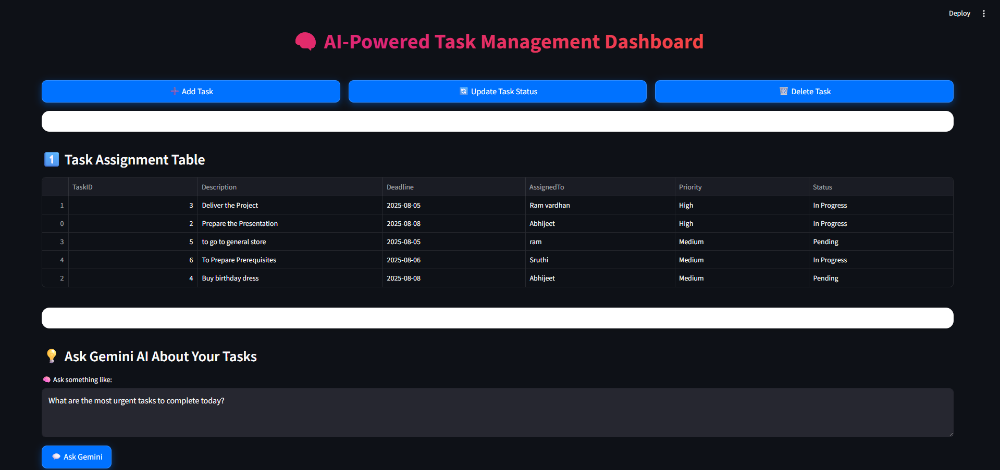

<style>
  body { background:#0d1117; color:#c9d1d9; }
  h1,h2,h3,h4 { color:#58a6ff; }
  a { color:#58a6ff; }
  code { background:#161b22; color:#f0f6fc; }
  pre { background:#161b22; border:1px solid #30363d; }
  blockquote { border-left:4px solid #58a6ff; background:#161b22; }
  hr { border-color:#30363d; }

  html { font-size: 16px !important; }          
  body { font-size: 1rem; line-height: 1.7; }  
  h1 { font-size: 2.2rem; }   
  h2 { font-size: 1.8rem; }  
  h3 { font-size: 1.5rem; }   
  h4 { font-size: 1.3rem; }  

  code, pre, kbd { font-size: 0.95rem; }

  ul, ol { font-size: 1rem; }

  .demo-btn {
    font-size: 1.1rem !important;
    padding: 10px 22px !important;
  }
</style>

# 🧠 AI Task Manager 2.8

A Streamlit-based AI Task Management dashboard that classifies, visualizes, and analyzes tasks using machine learning.

 <h1 align="center">
  🤖 AI-Powered Task Management System 
  <span style="
    background-color:#007BFF;
    color:white;
    font-weight:600;
    padding:4px 10px;
    border-radius:6px;
    font-size:0.85em;
    margin-left:8px;
  ">
    v2.8
  </span>
</h1>


<p align="center">
  <strong>Live Demo:</strong> 
  <a href="https://aitaskmanager28-bxahukjkzparonrie229uy.streamlit.app/" target="_blank">
    <span style="background:linear-gradient(90deg,#1f6feb,#388bfd);color:#fff;padding:8px 20px;border-radius:8px;font-weight:600;text-decoration:none;">
      Click Here
    </span>
  </a>
</p>

<p align="center">
  <em>“Where Artificial Intelligence meets Productivity.”</em><br>
  An enterprise-level AI-driven platform that intelligently classifies, prioritizes, and assigns tasks using NLP and Machine Learning — designed to supercharge teams with data-driven automation.
</p>

<hr>

## ✨ Key Highlights

| 🌟 Feature | 💡 Description |
|-------------|----------------|
| 🧠 **AI-Driven Task Allocation** | Automatically assigns and prioritizes tasks using workload, deadlines, and behavioral analytics. |
| 📊 **Interactive Dashboard** | Explore real-time visual analytics — task status, team performance, and model insights in one view. |
| ⚙️ **Adaptive Machine Learning Model** | Continuously learns from user data to refine task predictions and improve accuracy over time. |
| 📝 **Dual-Mode Task Control** | Seamlessly switch between manual edits and automated AI-based task assignment. |
| 📈 **Comprehensive Analytics** | Gain deep insights into productivity trends, overdue tasks, and efficiency ratios. |
| 🚀 **Future-Ready Integrations** | Designed for smooth integration with **Trello**, **Jira**, and **Slack** APIs for enterprise workflows. |


## 🛠️ Tech Stack

| 🔧 Category | 🧩 Tools & Technologies |
|--------------|-------------------------|
| 💻 **Languages & Libraries** | Python · Pandas · Streamlit · NumPy · Matplotlib · Scikit-learn |
| 🤖 **Machine Learning** | Classification models using Scikit-learn for task priority prediction and behavioral analysis |
| 📊 **Data Handling** | Structured CSV datasets (`tasks_cleaned.csv`, `user_data.csv`, `model_predictions.csv`) for reproducible results |
| 🎨 **UI & Visualization** | Streamlit for the dashboard UI with responsive layouts and real-time visual components |
| 🧠 **Analytics & Insights** | Matplotlib/Seaborn for performance graphs and prediction visualization |
| ⚙️ **Environment Management** | Virtual environments (`venv`) and `requirements.txt` for dependency reproducibility |
| ☁️ **Platform Compatibility** | Works seamlessly across **Windows**, **macOS**, and **Linux** environments |


<h2>📁 Project Structure</h2>

<p>The project is organized into logical sections — application logic, data files, configurations, and documentation — for easy navigation and scalability.</p>

<ul>
  <li>🧩 <strong><code>dashboard.py</code></strong> — The main Streamlit entry point that powers the user interface, handles task display, visualization, and ML insights in real time.</li>

  <li>🧠 <strong><code>smart_assigner.py</code></strong> — Implements AI-based task allocation logic that analyzes workload, deadlines, and user efficiency for intelligent distribution.</li>

  <li>🤖 <strong><code>task_classifier.py</code></strong> — Trains and applies machine learning models to classify and predict task priority using structured and textual features.</li>

  <li>🗃️ <strong><code>tasks_cleaned.csv</code></strong> — Stores the primary task dataset containing task IDs, descriptions, deadlines, assigned users, priority levels, and statuses.</li>

  <li>👥 <strong><code>user_data.csv</code></strong> — Tracks user performance data including task load, completion history, pending items, and behavior scores.</li>

  <li>📊 <strong><code>model_predictions.csv</code></strong> — Logs ML model outputs, confidence levels, and prediction accuracy metrics for ongoing model improvement.</li>

  <li>⚙️ <strong><code>requirements.txt</code></strong> — Lists all Python dependencies with version locking for a reproducible environment setup.</li>

  <li>🧩 <strong><code>.streamlit/</code></strong> — (Optional) Contains custom Streamlit configuration files for dashboard theming and layout customization.</li>

  <li>🖼️ <strong><code>assets/</code></strong> — Directory containing static files such as images and UI visuals (e.g., <code>dashboard.png</code>).</li>

  <li>🪶 <strong><code>README.md</code></strong> — Provides project overview, setup guide, usage instructions, and contribution workflow.</li>

  <li>🤝 <strong><code>CONTRIBUTING.md</code></strong> — Outlines contribution guidelines, branch naming conventions, and pull request submission steps.</li>

  <


## 🚀 Run Locally

Follow these steps to set up and run **AI Task Manager 2.8** on your local machine:

### 1️⃣ Clone the Repository
```bash
# Use the below command to clone the Repo
git clone https://github.com/ABHIJEET-0001/AI_TASK_MANAGER_2.8.git
# Open your folder using the below command
cd AI_TASK_MANAGER_2.8
```
### 2️⃣ Create and Activate a Virtual Environment
```bash

# Create a virtual environment
python -m venv venv

# Activate the environment
venv\Scripts\activate      # 🪟 Windows
source venv/bin/activate   # 🍎 macOS / 🐧 Linux

```
##### 💡 Tip: Always ensure you are using Python 3.10 – 3.12 for best compatibility.

### 3️⃣ Install Dependencies
```bash
pip install --upgrade pip
pip install -r requirements.txt
```
##### ⚙️ This will install Streamlit, Pandas, Scikit-learn, and all required libraries.
### 4️⃣ Verify Data Files
##### Make sure the following CSV files are available in the project root directory:
```bash
tasks_cleaned.csv
user_data.csv
model_predictions.csv
```
##### If any files are missing, refer to the 🧩 Data Format section below to recreate them.
### 5️⃣ Launch the Application
```bash
streamlit run dashboard.py
```

##### Then open your browser and go to 👉 http://localhost:8501

<h2>🧰 Troubleshooting Tips</h2>

<table>
  <thead>
    <tr>
      <th align="left">⚠️ Issue</th>
      <th align="left">💡 Solution</th>
    </tr>
  </thead>
  <tbody>
    <tr>
      <td><code>ModuleNotFoundError</code></td>
      <td>Run <code>pip install -r requirements.txt</code> again inside the activated virtual environment.</td>
    </tr>
    <tr>
      <td><code>OSError: Port 8501 already in use</code></td>
      <td>Run the app on a different port using <code>streamlit run dashboard.py --server.port 8502</code>.</td>
    </tr>
    <tr>
      <td>📂 Missing CSV files</td>
      <td>Ensure all required dataset files (<code>tasks_cleaned.csv</code>, <code>user_data.csv</code>, <code>model_predictions.csv</code>) are present in the project root.</td>
    </tr>
    <tr>
      <td>⚙️ Virtual environment not activating</td>
      <td>Recheck your Python installation path or restart your terminal, then try activating the environment again.</td>
    </tr>
  </tbody>
</table>

<p><strong>✅ Once the app starts successfully, you’ll see the <em>AI Task Manager Dashboard</em> running locally — ready for exploration!</strong></p>


<h2>📸 Dashboard Preview</h2>
<p align="center">
  
</p>

<h2>📊 Dashboard Modules</h2>

<p>
The <strong>AI Task Manager Dashboard</strong> provides an interactive and data-driven interface that blends machine learning insights with intuitive visualization. Each module is designed to give users a holistic view of team productivity and task prioritization.
</p>

<ul>
  <li>📋 <strong>Task Overview Table:</strong> Displays all active, pending, and completed tasks with quick filters and sorting by user, priority, and status.</li>
  <li>🥧 <strong>Priority Distribution Chart:</strong> Visualizes how tasks are spread across <em>High</em>, <em>Medium</em>, and <em>Low</em> priorities — helping identify workload balance.</li>
  <li>📈 <strong>User Performance Analytics:</strong> Tracks user efficiency, completed task ratios, and behavioral performance metrics in real-time.</li>
  <li>🧩 <strong>Model Accuracy Tracker:</strong> Monitors how well the ML model predicts priorities compared to actual user decisions, with precision and confidence scores.</li>
  <li>🤖 <strong>Smart Task Auto-Assigner:</strong> Automatically assigns new or unassigned tasks using workload, behavior analytics, and priority logic.</li>
  <li>✏️ <strong>Add/Edit Task Interface:</strong> Lets users manually create, update, or reassign tasks directly from the dashboard — no coding required.</li>
  <li>🔍 <strong>Summary Metrics Panel:</strong> Offers quick insights into total tasks, overdue count, completion rate, and pending workload.</li>
</ul>

<p><em>💡 These modules work together to create a unified, intelligent workflow — enabling data-driven decision-making and time-efficient task management.</em></p>


<h2>🧩 Data Format</h2>

<p>
The AI Task Manager relies on structured CSV datasets that feed data into the ML models and dashboard visualizations. Each file plays a unique role in tracking tasks, user performance, and model predictions.
</p>

<h3>👥 <code>user_data.csv</code> — User Performance & Behavior Metrics</h3>
<p>
Stores individual user statistics to measure productivity and workload distribution.
</p>

<pre><code>Username,CurrentTasks,CompletedTasks,PendingTasks,BehaviorScore
Alice,3,15,2,85
Bob,5,10,3,78
Carol,2,20,1,92
</code></pre>

<ul>
  <li><strong>Username:</strong> Identifier for each user.</li>
  <li><strong>CurrentTasks:</strong> Number of active tasks assigned.</li>
  <li><strong>CompletedTasks:</strong> Total completed tasks.</li>
  <li><strong>PendingTasks:</strong> Tasks awaiting completion.</li>
  <li><strong>BehaviorScore:</strong> ML-derived performance score (0–100).</li>
</ul>

---

<h3>📋 <code>tasks_cleaned.csv</code> — Task-Level Details</h3>
<p>
Represents the main dataset for task tracking and ML classification. It contains information about deadlines, assignments, and status.
</p>

<pre><code>TaskID,Description,Deadline,AssignedTo,Priority,Status
T001,Fix login bug,2025-11-10,Alice,High,In Progress
T002,Update documentation,2025-11-15,Bob,Medium,Pending
T003,Deploy to production,2025-11-08,Carol,High,Completed
</code></pre>

<ul>
  <li><strong>TaskID:</strong> Unique task identifier.</li>
  <li><strong>Description:</strong> Short summary of the task.</li>
  <li><strong>Deadline:</strong> Due date in <code>YYYY-MM-DD</code> format.</li>
  <li><strong>AssignedTo:</strong> User responsible for completion.</li>
  <li><strong>Priority:</strong> ML-assigned or user-defined level (High, Medium, Low).</li>
  <li><strong>Status:</strong> Task progress (Pending, In Progress, Completed).</li>
</ul>

---

<h3>📈 <code>model_predictions.csv</code> — Model Performance & Accuracy Logs</h3>
<p>
Captures the AI model’s prediction results compared to the actual outcomes for model evaluation and tuning.
</p>

<pre><code>TaskID,PredictedPriority,ActualPriority,Confidence
T001,High,High,0.92
T002,Medium,Medium,0.85
T003,High,High,0.88
</code></pre>

<ul>
  <li><strong>TaskID:</strong> Reference to the task from <code>tasks_cleaned.csv</code>.</li>
  <li><strong>PredictedPriority:</strong> AI-predicted priority category.</li>
  <li><strong>ActualPriority:</strong> Ground truth assigned manually or from data.</li>
  <li><strong>Confidence:</strong> Model’s confidence score (0–1 scale).</li>
</ul>

---

<p>
<em>⚠️ Tip:</em> Ensure consistent spelling for <strong>"Behavior"</strong> (not <strong>"Behaviour"</strong>) across all CSVs and scripts to avoid data mismatches.
</p>


<h2>🚧 Future Enhancements</h2>

<p>
AI Task Manager 2.8 is designed with scalability in mind. The following roadmap outlines upcoming features aimed at improving automation, collaboration, and cloud readiness.
</p>

<ul>
  <li>🔗 <strong>Integration with Trello, Jira & Slack APIs:</strong> Seamless synchronization with popular project management and communication tools for unified task tracking.</li>
  <li>💬 <strong>Smart Notifications via Email & Chatbot:</strong> Real-time alerts for deadlines, task updates, and status changes using conversational AI.</li>
  <li>🔐 <strong>Role-Based Authentication & Multi-User Access:</strong> Secure user management system with admin and member privileges for collaborative task handling.</li>
  <li>☁️ <strong>Real-Time Cloud Sync:</strong> Enable persistent data storage, cloud-hosted dashboards, and live updates across distributed teams.</li>
  <li>📱 <strong>Mobile-Responsive Dashboard:</strong> Optimized layout for smartphones and tablets to manage tasks on the go.</li>
  <li>🧩 <strong>Enhanced AI Models:</strong> Implement deep learning for smarter task prediction and improved accuracy in prioritization.</li>
</ul>

---

<h2>🐛 Troubleshooting & Common Issues</h2>

<p>
If you run into issues while setting up or running the app, here are some common errors and their quick fixes:
</p>

<table>
  <thead>
    <tr>
      <th>⚠️ Issue</th>
      <th>💡 Solution</th>
    </tr>
  </thead>
  <tbody>
    <tr>
      <td><strong>ModuleNotFoundError</strong></td>
      <td>Ensure your virtual environment is activated, then run:<br><code>pip install -r requirements.txt</code></td>
    </tr>
    <tr>
      <td><strong>OSError: Port 8501 already in use</strong></td>
      <td>Run the app on a different port:<br><code>streamlit run dashboard.py --server.port 8502</code></td>
    </tr>
    <tr>
      <td><strong>Missing CSV Files</strong></td>
      <td>Verify that <code>tasks_cleaned.csv</code>, <code>user_data.csv</code>, and <code>model_predictions.csv</code> exist in the project root folder.</td>
    </tr>
    <tr>
      <td><strong>Virtual Environment Not Activating</strong></td>
      <td>Recheck your Python installation path or restart your terminal session.</td>
    </tr>
    <tr>
      <td><strong>Streamlit Version Error</strong></td>
      <td>Use Python 3.10–3.12 and install the correct version:<br><code>pip install streamlit==1.39.0</code></td>
    </tr>
    <tr>
      <td><strong>File Path Errors</strong></td>
      <td>Run the app from the project root:<br><code>streamlit run dashboard.py</code></td>
    </tr>
  </tbody>
</table>

<p>
✅ <strong>Tip:</strong> Once the app launches successfully, open <a href="http://localhost:8501" target="_blank">http://localhost:8501</a> to explore the <strong>AI Task Manager Dashboard</strong> locally.
</p>

<br>
<h2 align="center">🤝 Contributing</h2>

<p align="center">
  <em>We love and welcome contributions from everyone — whether you’re fixing bugs, improving documentation, or adding powerful new features! 💡</em>
</p>

<ul>
  <li>🌱 <strong>Explore Issues:</strong> Browse open <a href="https://github.com/ABHIJEET-0001/AI_TASK_MANAGER_2.8/issues" target="_blank">issues</a> and choose one that aligns with your interest or skill set.</li>
  <li>🛠️ <strong>Enhance Features:</strong> Improve machine learning models, optimize data pipelines, or refine the dashboard UI for better UX.</li>
  <li>📝 <strong>Improve Documentation:</strong> Clarify setup steps, add code examples, or contribute visual guides and screenshots.</li>
  <li>🧪 <strong>Write or Improve Tests:</strong> Help strengthen reliability and performance through meaningful test coverage.</li>
  <li>💬 <strong>Suggest Ideas:</strong> Share feedback and new feature proposals in the <a href="https://github.com/ABHIJEET-0001/AI_TASK_MANAGER_2.8/discussions" target="_blank">Discussions</a> tab.</li>
</ul>

---

<h3>🧭 Step-by-Step Contribution Workflow</h3>

<pre><code># 1️⃣ Fork the repository
# This creates your personal copy under your GitHub account
https://github.com/ABHIJEET-0001/AI_TASK_MANAGER_2.8/fork

# 2️⃣ Clone your fork locally
git clone https://github.com/&lt;your-username&gt;/AI_TASK_MANAGER_2.8.git
cd AI_TASK_MANAGER_2.8

# 3️⃣ Create a new branch for your contribution
git checkout -b docs/enhance-readme-contrib

# 4️⃣ Make your changes
# Example: edit README.md, improve documentation, or enhance features
# You can open the folder in VS Code:
code .

# 5️⃣ Stage your changes
git add .

# 6️⃣ Commit with a meaningful message
Example: git commit -m "docs: enhance README with setup, contribution, and reproducibility details"

# 7️⃣ Push your branch to your fork
Example: git push origin docs/enhance-readme-contrib

# 8️⃣ Open a Pull Request (PR)
# Go to your forked repository on GitHub
# Click “Compare & pull request”
# Add a clear title, description, and mention the related issue number if applicable
</code></pre>

---

<h3>📋 Contribution Best Practices</h3>

<ul>
  <li>✅ Keep your PRs focused — smaller, well-defined changes are easier to review.</li>
  <li>📄 Follow the existing <a href="./CONTRIBUTING.md"><strong>CONTRIBUTING.md</strong></a> file for detailed workflow and coding standards.</li>
  <li>💬 Communicate early — comment on issues before starting to avoid duplicate work.</li>
  <li>🔍 Always test your changes locally before committing.</li>
</ul>

---

<p align="center">
  💡 <em>Every contribution matters — from improving a single line of documentation to building new features.  
  Let’s make AI Task Manager smarter, together!</em> 🚀
</p>


<h2>🎓 Ideal For</h2>
<ul>
  <li>🧑‍🎓 <strong>Students & Learners:</strong> Gain hands-on experience in <em>AI, Machine Learning, and NLP</em> by exploring practical task management and automation workflows.</li>
  <li>💻 <strong>Developers & Engineers:</strong> Build and enhance intelligent productivity tools — from task prioritization systems to data-driven dashboards.</li>
  <li>🌍 <strong>Open Source Contributors:</strong> Collaborate on a real-world ML project, sharpen your Git and documentation skills, and make meaningful contributions to an evolving AI tool.</li>
  <li>🚀 <strong>Data Enthusiasts:</strong> Experiment with structured datasets, train predictive models, and visualize insights through an interactive Streamlit interface.</li>
  <li>🧠 <strong>Researchers & Innovators:</strong> Prototype new ideas around smart automation, workload prediction, and adaptive decision-making systems.</li>
</ul>


<h2>🙌 Acknowledgements</h2>
<ul>
  <li>👨‍💻 <strong>Created & Maintained by:</strong> <a href="https://github.com/ABHIJEET-0001" target="_blank">Abhijeet Kasera</a></li>
  <li>💡 <strong>Inspiration:</strong> Driven by a passion to combine <em>Artificial Intelligence</em> with <em>Task Management</em> — empowering smarter prioritization, automation, and productivity through data-driven insights.</li>
  <li>🌍 <strong>Community:</strong> A heartfelt thanks to all open-source contributors, testers, and collaborators who help make AI Task Manager smarter with every release.</li>
</ul>

<h2>📜 License</h2>
<p>
  This project is licensed under the 
  <a href="./LICENSE"><strong>MIT License</strong></a> — you’re free to use, modify, and distribute this software, provided appropriate credit is given.
</p>

<hr>

<p align="center">
  💡 <em>Crafted with precision, powered by AI, and designed for innovation.</em><br>
  <strong>Made with ❤️ by <a href="https://github.com/ABHIJEET-0001" target="_blank">Abhijeet Kasera</a></strong>
</p>
